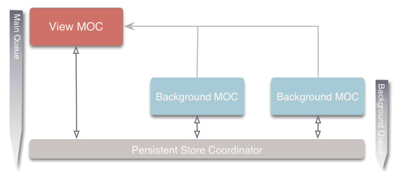
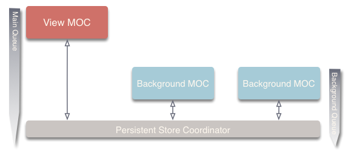
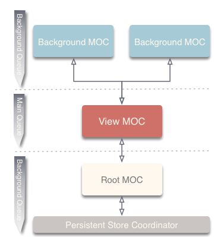
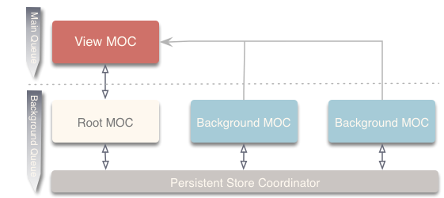

# Coherence

**Coherence**, the configurable CoreData extension for the Web Service era.  Coherence helps you build apps that require persistence, offline storage, store and forward and web connectivity. It provides you with a comprehensive framework for managing low level resources intelligently and efficiently.

## Table of Contents

* [**Overview**](README.md#overview)
* [Quick Start Guide](Quick&#32;Start&#32;Guide.md)
* Usage
  * [Initialization & Startup](Initialization&#32;&amp;&#32;Startup.md)
  * [Actions](Actions.md)

# Overview

### Connect
At the heart of Coherence are it's resource management services which are expose via the `Connect` protocol. Coherence provides a generic concrete implementation of the `Connect` protocol with the `GenericConnect` class. Coherence takes on the role of a persistent container creating and managing a core data stack for you.  All services it offers outside this are built on top of the `GenericConnect` instance.

### Container

Connect's container is built on top of the Coherence Container which is an implementation of the `PersistentStack` protocol.

### Context Strategy

Coherence gives you a choice of ManagedObjectContext strategies used by a PersistentStack instance.  `ContextStrategy` classes encapsulate the layout and behavior of the ManagedObjectContexts of the CoreData stack. `Connect` currently has 4 built in strategies `Direct`, `DirectIndependent`, `IndirectNested` and `Mixed`.  If one of these strategies doesn't give you what you require for your application, you can also create your own by implementing the `ContextStrategyType` protocol.

###### Direct

A strategy that manages the viewContext and BackgroundContext connected directly to the `NSPersistentStoreCoordinator`.  Changes made to `BackgroundContext`s are propagated directly to the persistentStore allowing merge policies to be set and respected.

- Note: The view context will be kept up to date and persisted to the store when a background context is saved.

###### Direct Independent

A strategy that manages independent contexts (for view and background) connected directly to the `NSPersistentStoreCoordinator`.

- Note: The view context will not be kept up to date with this strategy.

###### Indirect Nested

A strategy that manages nested (parent/child) contexts (for view and background) connected indirectly through a root context to the `NSPersistentStoreCoordinator`.

Propagation of changes to the persistent store are done indirectly in the background through a root context.

- Note: The view context will be kept up to date and persisted to the store when a background context is saved.

###### Mixed

A strategy that manages a nested (parent/child) viewContexts connected indirectly
through a root context to the `NSPersistentStoreCoordinator` and background contexts
that are connected directly to the `NSPersistentStoreCoordinator`.

Changes made to BackgroundContexts are propagated directly to the persistentStore
allowing merge policies to be set and respected. `viewContext` updates are done purely
in memory and propagated to the persistentStore indirectly in a background thread
through the rootContext.

- Note: The view context will be kept up to date and persisted to the store when a background context is saved.

