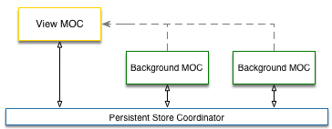
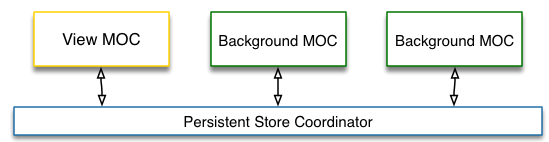
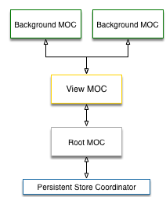
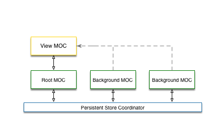

> :warning: **WARNING** :warning: The **3.0.0-beta.x** versions of this project are in a _prerelease_ state. There
> is active work going on that will result in API changes that can/will break code while things are finished.  Use with caution.
>
>  For a stable release, please use version [2.0.4](https://github.com/tonystone/coherence/releases/tag/2.0.4)

# Coherence 

<a href="https://travis-ci.org/tonystone/coherence" target="_blank">
  
</a>
<a href="https://codecov.io/gh/tonystone/coherence" target="_blank">
  
</a>

Coherence the configurable CoreData extension for the WebService era.  Coherence helps you build apps that require persistence, offline storage, store and forward and web connectivity.

#### Configurable Context Strategies

Coherence gives you a choice of ManagedObjectContext strategies used by a PersistentStack instance.  `ContextStrategy` classes encapsulate the layout and behavior of the ManagedObjectContexts of the CoreData stack. `Connect` currently has 4 built in strategies `Direct`, `DirectIndependent`, `IndirectNested` and `Mixed`.  If one of these strategies don't give you what you require for your application, you can also create your own by implementing the `ContextStrategyType` protocol.

###### Direct (ContextStrategy)

A strategy that manages the viewContext and BackgroundContext connected directly to the `NSPersistentStoreCoordinator`.

Changes made to `BackgroundContext`s are propagated directly to the persistentStore allowing merge policies to be set and respected.

- Note: The view context will be kept up to date and persisted to the store when a background context is saved.

###### Direct Independent (ContextStrategy)

A strategy that manages independent contexts (for view and background) connected directly to the `NSPersistentStoreCoordinator`.

- Note: The view context will not be kept up to date with this strategy.

###### Indirect Nested (ContextStrategy)

A strategy that manages nested (parent/child) contexts (for view and background) connected indirectly through a root context to the `NSPersistentStoreCoordinator`.

Propagation of changes to the persistent store are done indirectly in the background through a root context.

- Note: The view context will be kept up to date and persisted to the store when a background context is saved.

###### Mixed (ContextStrategy)

A strategy that manages a nested (parent/child) viewContexts connected indirectly
through a root context to the `NSPersistentStoreCoordinator` and background contexts
that are connected directly to the `NSPersistentStoreCoordinator`.

Changes made to BackgroundContexts are propagated directly to the persistentStore
allowing merge policies to be set and respected. `viewContext` updates are done purely
in memory and propagated to the persistentStore indirectly in a background thread
through the rootContext.

- Note: The view context will be kept up to date and persisted to the store when a background context is saved.

## Requirements

| Xcode | Swift | iOS |
|:-----:|:-----:|:---:|
|  8.3  |  3.1  | 9.0 |

## Author

Tony Stone ([https://github.com/tonystone] (https://github.com/tonystone))

## License

Coherence is released under the [Apache License, Version 2.0] (http://www.apache.org/licenses/LICENSE-2.0.html)
